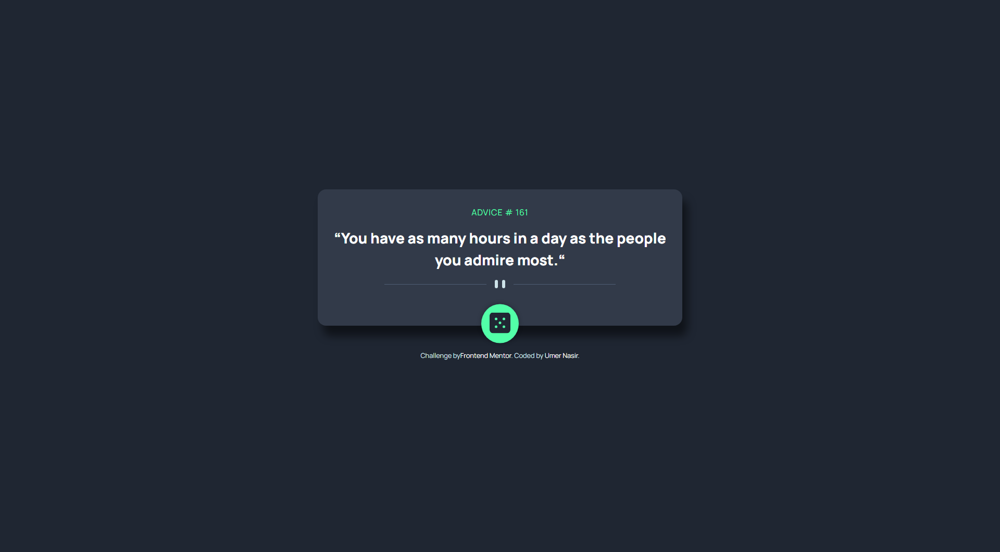
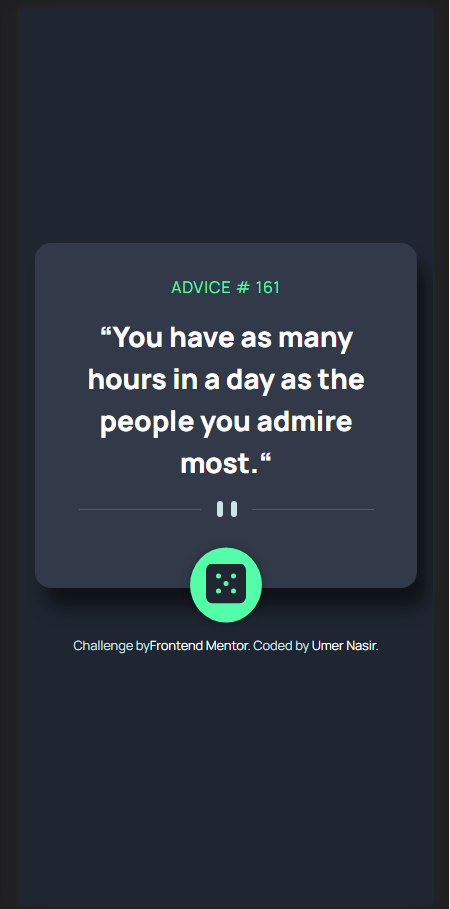

# Frontend Mentor - Advice generator app solution

This is a solution to the [Advice generator app challenge on Frontend Mentor](https://www.frontendmentor.io/challenges/advice-generator-app-QdUG-13db). Frontend Mentor challenges help you improve your coding skills by building realistic projects.

## Table of contents

- [Frontend Mentor - Advice generator app solution](#frontend-mentor---advice-generator-app-solution)
  - [Table of contents](#table-of-contents)
  - [Overview](#overview)
    - [The challenge](#the-challenge)
    - [Screenshot](#screenshot)
    - [Links](#links)
  - [My process](#my-process)
    - [Built with](#built-with)
    - [What I learned](#what-i-learned)
  - [Author](#author)

## Overview

### The challenge

Users should be able to:

- View the optimal layout for the app depending on their device's screen size
- See hover states for all interactive elements on the page
- Generate a new piece of advice by clicking the dice icon

### Screenshot





### Links

- Solution URL: [Github Repository](https://github.com/UmerNasir-2000/fem-advice-generator)
- Live Site URL: (https://fem-advice-generator-pftn.vercel.app/)

## My process

My process is very straightforward, I first make sure that the functionality of the application is working then I proceed to the styling section which helps me focus on having just one problem at a time.

### Built with

- Semantic HTML5 markup
- SASS
- Flexbox
- Mobile-first workflow
- [React](https://reactjs.org/)
- [Vite](https://vitejs.dev/)
- [Typescript](https://www.typescriptlang.org/)

### What I learned

I used SCSS for the first time is this project and learned to applied animations for the loading state. Other than it was a really fun project to implement.

```css
@keyframes rotate {
  0% {
    transform: rotate(0deg);
  }
  100% {
    transform: rotate(360deg);
  }
}

.roll {
  animation: rotate 0.3s linear infinite;
}
```

## Author

- Website - [Umer Nasir](https://github.com/UmerNasir-2000)
- Frontend Mentor - [@UmerNasir-2000](https://www.frontendmentor.io/profile/UmerNasir-2000)
- Twitter - [@UmerUknUmer](https://www.twitter.com/UmerUknUmer)
